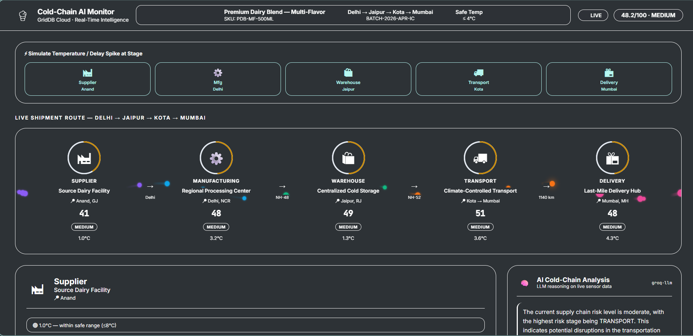
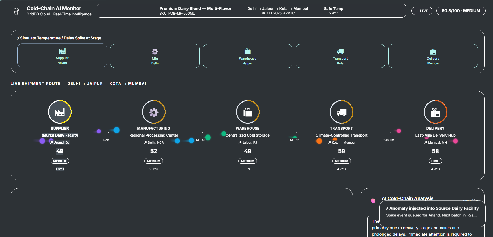
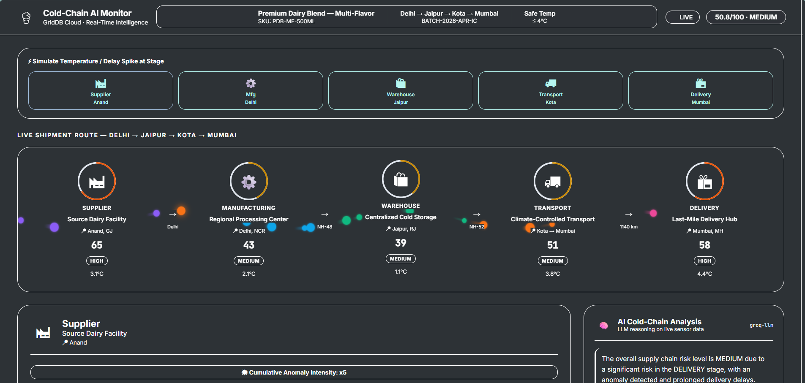
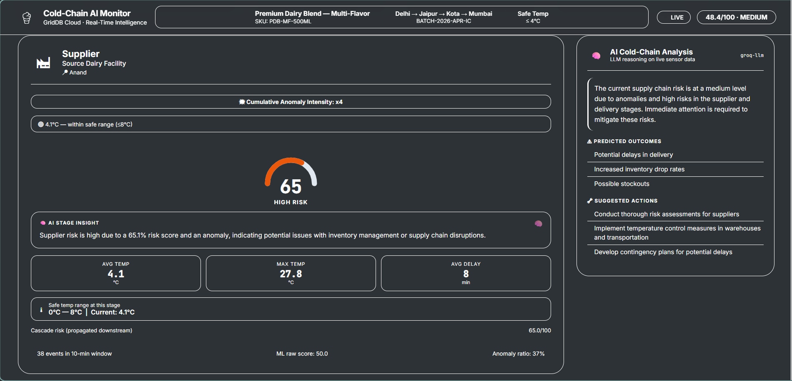
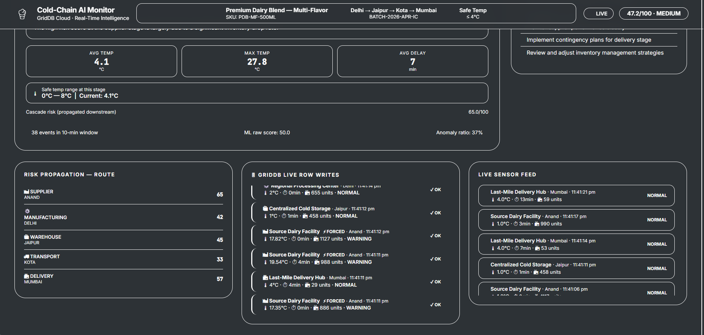

# AI-Powered Multi-Stage Supply Chain Intelligence System with GridDB

## 1. Introduction: From Monitoring to Intelligence  
Modern supply chains generate massive amounts of data such as location updates, temperature readings, delays, and inventory changes at every stage. However, most systems still treat this data as isolated signals, monitoring each stage independently and reacting only after problems become visible.

In reality, supply chains behave as interconnected systems where a small disruption at one stage, like a temperature spike during transport, can propagate downstream and impact storage, delivery timelines, and product quality.

This system moves beyond traditional monitoring by introducing an AI-powered approach that uses time-series data in GridDB, applies machine learning to detect anomalies, models how risk propagates across stages, and uses LLMs to generate actionable insights, enabling not just visibility but prediction and decision support.

## 2. The Problem: Why Traditional Supply Chain Systems Fail  
Traditional supply chain systems focus on tracking rather than intelligence. They monitor stages independently and rely on fixed thresholds, which limits their ability to understand how issues evolve and spread.

Key limitations:

- **Lack of temporal awareness**  
  No focus on trends or sudden changes over time        

- **Stage-wise isolation**  
  Each stage is monitored separately without cross-stage context  

- **Static thresholds**  
  Fixed rules miss complex or evolving patterns  

- **No cascade understanding**  
  Systems do not model how disruptions propagate  

- **Reactive approach**  
  Problems are detected only after they become critical  

## 3. Understanding Supply Chains as Cascade Systems  
Supply chains operate as interconnected pipelines, not isolated stages. Each stage depends on the state of the previous one, which means disruptions do not stay local. They propagate forward and often amplify over time.

This cascading nature leads to:

- Dependency-driven flow  
  Each stage inherits the conditions of upstream stages  

- Amplification of disruptions  
  Small issues can grow into significant failures downstream  

- Delayed impact  
  A problem may originate early but surface only at later stages  

- System-wide risk  
  A single disruption can affect the entire supply chain  

## 4. System Overview and Architecture  

The system is designed as a real-time intelligence pipeline that continuously ingests, processes, and analyzes supply chain data. Instead of static monitoring, it operates on streaming time-series events to detect risks as they evolve.

### Overall Architecture  

The system follows a layered architecture where each component contributes to transforming raw data into actionable insights.


### Data Simulation and Ingestion  

A simulation layer generates continuous multi-stage events such as temperature, delay, and inventory changes. These events mimic real-world supply chain behavior, including normal operations and anomaly scenarios.

### Time-Series Storage (GridDB)  

All events are stored in GridDB as time-series data. This enables efficient ingestion and fast querying over recent time windows, which is critical for real-time analysis.

### Feature and Intelligence Layer  

Raw events are transformed into structured feature vectors that capture patterns such as averages, variability, and changes over time. These features are then used by the machine learning model to detect anomalies.

### Risk and Cascade Engine  

The system computes risk at each stage and models how disruptions propagate across the supply chain. This allows it to capture both local anomalies and their downstream impact.

### LLM Reasoning Layer  

A language model interprets system outputs and generates human-readable insights. It explains the situation, predicts possible outcomes, and suggests corrective actions.

### Real-Time API and Dashboard  

A FastAPI backend streams live updates to a dashboard, providing visibility into stage-wise risk, cascading effects, and system-wide status in real time.

```python
# System orchestration in main.py
@asynccontextmanager
async def lifespan(app: FastAPI):
    # Startup: Initialize DB and background producer
    await db.init_db()
    task = asyncio.create_task(run_producer())
    yield
    # Shutdown logic...
```

## 5. GridDB Cloud: Seamless High-Performance Storage

After you create your [GridDB cloud account](https://www.global.toshiba/ww/products-solutions/ai-iot/griddb/product/griddb-cloud.html) and complete configuration settings, you can run the following script to see if you can access your database within a Python application. You can also quickly set up an instance via the [Microsoft Azure Marketplace](https://portal.azure.com/#create/2812187.griddb_cloud_payasyougo) using the Pay-As-You-Go model to obtain your credentials.

For this system, we utilize **GridDB Cloud**, a fully managed database-as-a-service. It allows us to offload the complexity of database management while retaining the extreme high-performance characteristics of the GridDB engine.

### Connecting via Web API (REST)

The GridDB Cloud is communicated with exclusively via a secure **Web API**. This enables us to interact with the database using standard HTTPS requests, making it highly compatible with modern cloud-native Python applications.

We authenticate using **Basic Authorization**, where our credentials (username and password) are encoded into a base-64 string and sent in the HTTP headers.

```python
# db/griddb_client.py config setup
GRIDDB_HOST     = os.getenv("GRIDDB_HOST")
GRIDDB_CLUSTER  = os.getenv("GRIDDB_CLUSTER")
GRIDDB_DATABASE = os.getenv("GRIDDB_DATABASE")

BASE_URL = f"https://{GRIDDB_HOST}/griddb/v2/{GRIDDB_CLUSTER}/dbs/{GRIDDB_DATABASE}"
AUTH = httpx.BasicAuth(USER, PASSWORD)
```

### Checking Connection

Before starting the live ingestion, we perform a sanity check using the `/checkConnection` endpoint to ensure the cloud instance is reachable and the credentials are valid.

```python
# Verified via 200 OK status code
resp = httpx.get(f"{BASE_URL}/checkConnection", auth=AUTH)
if resp.status_code == 200:
    print("Successfully connected to GridDB Cloud!")
```

### Automated Container Management

In a real-time system, we cannot afford manual intervention. Our system automatically ensures that the necessary **TimeSeries** and **Collection** containers exist on startup. If they are missing, the system creates them using the `/containers` endpoint.

```python
# Idempotent container creation
def _ensure_container():
    url = f"{BASE_URL}/containers"
    # POST creates the container with the defined schema
    resp = httpx.post(url, json=CONTAINER_SCHEMA, auth=AUTH)
    if resp.status_code in (200, 201):
        print("GridDB container initialized.")
```

## 6. Why GridDB for Time-Series Data  

This system depends on continuous streams of time-dependent data such as temperature, delays, and inventory changes. Efficient handling of this data requires a database specifically designed for time-series workloads, which makes GridDB a strong fit.

- GridDB is designed for time-series data, allowing events to be stored and queried efficiently in chronological order  

- It supports high-frequency ingestion, enabling continuous event streams to be written with low latency  

- The system relies on analyzing recent data, and GridDB enables fast time-window queries without complex indexing  

- Its memory-first architecture allows quick access to recent events, which is critical for real-time ML processing  

- It scales well with increasing data volume, making it suitable for multi-stage, continuously evolving systems  

- Compared to traditional databases, it handles time-series workloads more efficiently, while generic NoSQL systems lack built-in temporal optimizations  

### Time-Window Query with GridDB (TQL)

```python
# Fetching the last 10 minutes of sensor data for ML analysis
def query_recent(container_name, minutes=10):
    tql = f"SELECT * WHERE timestamp > TIMESTAMP_ADD(NOW(), -{minutes}, MINUTE)"
    query = container.query(tql)
    return query.fetch()
```

GridDB serves as the foundation of the system, enabling real-time ingestion, fast analysis, and continuous intelligence over evolving data streams.

## 7. Modeling a Multi-Stage Supply Chain  

The supply chain is modeled as a sequence of interconnected stages where each stage depends on the previous one.

Supplier → Manufacturing → Warehouse → Transport → Delivery  

Each stage generates time-series events (temperature, delay, inventory), and the output of one stage becomes the input condition for the next. This allows the system to track how disruptions originate, evolve, and propagate across the entire pipeline.

### Stage Configuration Baseline

```python
_STAGE_CFG = {
    "SUPPLIER":      {"temp": (1, 5),   "thresh": 8,   "delay": (0, 5)},
    "MANUFACTURING": {"temp": (2, 7),   "thresh": 10,  "delay": (0, 8)},
    "WAREHOUSE":     {"temp": (1, 4),   "thresh": 7,   "delay": (0, 6)},
    "TRANSPORT":     {"temp": (3, 8),   "thresh": 12,  "delay": (0, 15)},
    "DELIVERY":      {"temp": (4, 10),  "thresh": 15,  "delay": (0, 20)},
}
```

## 8. Simulating Real-World Supply Chain Events  

To replicate real-world behavior, the system simulates continuous supply chain events across multiple stages. Each event includes attributes such as temperature, delay, inventory, and status.

Instead of generating static values, the simulation introduces controlled randomness and anomalies to mimic real operational conditions.

- Normal flow  
  Events are generated within safe ranges to represent stable system behavior  

- Anomaly injection  
  Sudden spikes in temperature or delay are introduced to simulate real disruptions such as cooling failure or traffic delays  

- Continuous streaming  
  Events are produced at regular intervals to emulate real-time data flow  

### Event Generation with Drift

```python
def _generate_event(stage, force_anomaly=False, drift_factor=0.0):
    cfg = STAGE_CFG[stage]
    # Normal readings drift toward thresholds based on upstream stress
    temp_ceiling = cfg["t_lo"] + (cfg["thresh"] - cfg["t_lo"]) * drift_factor
    temp = round(random.uniform(cfg["t_lo"], temp_ceiling), 2)
    
    return {
        "stage": stage,
        "temperature": temp,
        "status": "NORMAL" if drift_factor < 0.5 else "WARNING"
    }
```
### Dynamic Anomaly Injection

```python
if is_anomaly:
    # Spike temperature above safety threshold
    base_spike = TEMP_SPIKE_ADD[stage]
    temp = round(thresh + random.uniform(2, base_spike), 2)
    status = "ANOMALY"
```
### High-Frequency Data Producer (Batch Mode)

```python
async def run_producer():
    while True:
        # Generate and insert a full 5-stage batch concurrently
        batch = generate_batch(force_anomaly_stage=forced_stage)
        await asyncio.gather(*[db.insert(evt) for evt in batch])
        await asyncio.sleep(INTERVAL_SECONDS) # Currently 2s
```
This simulation approach ensures that the system experiences both stable and disruptive conditions, allowing it to learn patterns, detect anomalies, and model cascading failures effectively.

## 9. Machine Learning for Anomaly Detection  

To detect unusual patterns in supply chain behavior, the system uses an unsupervised machine learning approach instead of relying on fixed thresholds.

### Model Overview  

| Component        | Description |
|-----------------|------------|
| Model Type      | Isolation Forest |
| Learning Type   | Unsupervised |
| Input           | Feature vectors (temperature, delay, inventory trends) |
| Output          | Anomaly score (0–100) |
| Purpose         | Identify deviations from normal behavior |

### ML Feature Vectors

```python
# Features extracted from time-series windows
FEATURES = [
    "mean_temp", "max_temp", "std_temp",
    "mean_delay", "max_delay",
    "inventory_drop_rate", # Speed of stock depletion
    "anomaly_flag_ratio"   # Ratio of warnings in time-window
]
```

### How It Works  

| Step | Description |
|------|------------|
| 1. Feature Extraction | Raw events are converted into structured feature vectors |
| 2. Model Evaluation   | The model evaluates how different the current data is from normal patterns |
| 3. Anomaly Scoring    | A score is generated indicating the level of deviation |
| 4. Risk Integration   | The score is passed to the risk engine for further analysis |

### Example  

```python
features = extract_features(events)
prediction = model.predict(features)
```

## 10. Temporal Intelligence and Risk Scoring  

Anomalies in supply chains are rarely defined by a single data point. What matters is how conditions change over time. A stable temperature at 8°C may be acceptable, but a rapid rise from 4°C to 8°C within minutes indicates a developing issue.

This system captures such behavior using temporal intelligence, focusing on how signals evolve rather than just their current values.

- Recent state  
  The latest event reflects the current condition of the stage  

- Direction of change  
  Identifies whether the system is stabilizing or moving toward risk  

- Sudden deviations  
  Detects sharp jumps between consecutive events, which often signal failures  

- Pattern accumulation  
  Repeated minor anomalies over time increase overall risk  

These temporal signals are combined with the ML anomaly score to compute a final risk value. Instead of assigning fixed labels, the system produces a continuous risk score that reflects both the severity and the progression of the issue.

```python
# Blend ML results with rule-based temporal penalties
ml_prediction = model.predict(features)
risk_score = ml_prediction["score"]

# Penalty for high ratio of sensor warnings in the recent window
if features["anomaly_flag_ratio"] > 0.3:
    risk_score += 15.0

final_risk = min(100, risk_score)
```

## 11. Cascade Risk Propagation Across Stages  

In supply chains, risks do not remain isolated to a single stage. A disruption at one point can propagate downstream, influencing subsequent stages and increasing the overall system risk. The system models this behavior by treating the supply chain as a connected pipeline where each stage inherits a portion of the risk from the previous stage.

Supplier → Manufacturing → Warehouse → Transport → Delivery  

As risk moves forward, it can amplify, especially in later stages that are closer to the final outcome. This means that even a moderate issue early in the pipeline can evolve into a significant problem downstream. The final risk at each stage is therefore a combination of its local conditions and the inherited upstream risk, while a global risk score provides a system-wide view of supply chain health.

This approach enables the system to go beyond isolated anomaly detection and capture how disruptions evolve into larger, cascading failures across the entire supply chain.
```python
# Forward propagation: each stage 'leaks' risk to the next
prev_risk = 0.0
for stage in STAGES:
    local_risk = stage_risks[stage]
    leaked = ALPHA * prev_risk
    
    # Combined score with a soft-cap to prevent overflow
    combined = min(100.0, local_risk + leaked * (1 - local_risk / 100.0))
    propagated[stage] = combined
    prev_risk = combined
```

## 12. LLM-Powered Reasoning and Decision Support  

While the system can detect anomalies and compute risk scores, these outputs are still numerical and require interpretation. To bridge this gap, an LLM layer is introduced to convert system signals into clear, actionable insights.

The model receives contextual information such as stage-wise risk, recent trends, and anomaly patterns, and generates a human-readable explanation of the current situation. Instead of just indicating that a stage is at high risk, it explains why the risk exists, what it could lead to, and what actions should be taken.

For example, a temperature spike during transport combined with increasing delays may be interpreted as a potential cold-chain failure, leading to product degradation. The LLM can then suggest corrective actions such as rerouting, activating backup cooling, or prioritizing delivery.

### Building the Contextual Prompt

```python
def _build_prompt(stage_risks, cascade):
    prompt = f"Global Risk: {cascade['global_risk']}/100\n"
    for stage, risk in stage_risks.items():
        prompt += f"{stage}: Risk {risk['score']}, Temp {risk['avg_temp']}°C\n"
    
    prompt += "\nExplain the situation and suggest 3 corrective actions."
    return prompt
```

```python
prompt = f"""
Stage risks: {stage_risks}
Recent trends: {trends}

Explain the situation, predict outcomes, and suggest actions.
"""
response = llm(prompt) 
```

## 13. Scenario Walkthrough: Supply Chain Cascade Intelligence  

To demonstrate how the system behaves in a real-world setting, let’s follow a batch of **Premium Dairy Blend (SKU: PDB-MF-500ML)** on its journey from Anand to Mumbai.

**The Journey: Delhi → Jaipur → Kota → Mumbai**

### 1. Stable Baseline at Source Dairy (Anand)
The journey begins at the **Source Dairy Facility**. Raw product is collected and chilled to a steady -2°C. The GridDB live feed shows continuous `NORMAL` status messages, and the dashboard reports a low-risk baseline (Green) across all stages.

### 2. Processing at Regional Processing Center (Delhi)
The product is processed and blast-frozen at the **Regional Processing Center**. The system monitors a slight 10-minute delay due to a shift change, but because the temperature remains locked at -18°C, the ML model maintains a "Low Risk" score.

### 3. Emerging Warning at Centralized Cold Storage (Jaipur)
During storage at the **Centralized Cold Storage** hub, a cooling fan begins to vibrate, causing the temperature to creep from -18°C up to -1°C. While this is still below the critical melting point, the **Temporal Engine** detects the abnormal direction of change. The stage turns orange (**WARNING**), signaling a potential developing issue.

### 4. Critical Anomaly at Climate-Controlled Transport (Kota Transits)
The most critical disruption occurs during transit with the **Climate-Controlled Transport** fleet. A compressor failure on NH-52 causes the internal truck temperature to spike to **14°C**—well above the **10°C critical threshold**. The ML model immediately flags a "High Risk" anomaly.

### 5. Cascading Risk at Last-Mile Delivery Hub (Mumbai)
This is where the intelligence layer shines. Even though the shipment hasn't reached the **Last-Mile Delivery Hub** in Mumbai yet, the **Cascade Engine** identifies the "thermal debt" inherited from the transport failure. It automatically elevates the Mumbai delivery stage to **HIGH RISK (85/100)**, warning the operations team to prepare for a "Quality Risk" rejection before the truck even arrives.

```text
Transport (Kota) → ANOMALY: Critical Temp Spike (14°C)
Delivery (Mumbai) → HIGH RISK: Cascaded Thermal Debt
Result: Automated Batch Quarantine Suggestion
```

## 14. Real-Time Dashboard and System Behavior  

The system's real-time dashboard provides a comprehensive view of the entire supply chain, enabling stakeholders to monitor conditions, detect anomalies, and respond quickly to disruptions.

### Key Features  

| Feature | Description |
|---------|------------|
| Live Event Feed | Displays real-time events as they are generated and inserted into the database |
| Stage-wise Monitoring | Visualizes current conditions for each stage in the supply chain |
| Anomaly Detection | Highlights anomalous events and indicates risk levels |
| Risk Visualization | Shows risk scores for each stage and the overall system |
| Interactive Controls | Allows users to trigger and manage anomaly simulations |

### Dashboard Components  

| Component | Purpose |
|-----------|--------|
| Event Stream | Real-time log of all events with timestamps and details |
| Stage Cards | Individual cards for each stage showing temperature, delay, and risk |
| Anomaly Controls | Buttons to simulate normal or anomalous conditions |
| Risk Gauge | Visual indicator of overall supply chain health |
| System Status | Real-time status of the producer and database connections |

### User Interactions  

- **Generate Normal Events**  
  Simulates standard supply chain operations with random variations  

- **Trigger Anomaly**  
  Injects controlled anomalies to test system response  

- **Monitor Propagation**  
  Observes how disruptions evolve across stages over time  

- **View Insights**  
  Reads LLM-generated explanations of current conditions and risks  

### Real-Time Feed via SSE (Frontend)

```javascript
// Listening for live sensor updates from the FastAPI stream
const eventSource = new EventSource("/api/stream");
eventSource.onmessage = (event) => {
    const data = JSON.parse(event.data);
    updateDashboard(data.stage_risks, data.cascade);
};
```

### System in Action: Dashboard Gallery

Below is a visual walkthrough of the system's behavior across different operational states.

#### 1. Normal Stable Operations
The system maintains a low-risk baseline (Green) across all stages when sensors are operating within safe cold-chain parameters.


#### 2. Manual Anomaly Injection
Users can stress-test the system by injecting anomalies into specific stages. This triggers immediate sensor spikes in the selected phase.


#### 3. Real-Time Risk & Cascade Propagation
Notice how a failure in an upstream stage (e.g., Transport) automatically elevates the risk scores of downstream stages (e.g., Delivery) even before they reach critical levels.


#### 4. LLM-Powered Reasoning & Stage Deep-Dive
The LLM interprets the raw sensor data and provides a contextual explanation of why the risk is rising and what actions the operations team should take.


#### 5. Live Feed & Row Ingestion (Forced Anomaly)
The "GridDB Live Row Writes" feed shows high-frequency data ingestion, with 'FORCED' tags highlighting the specifically injected events for clear auditing.



## 15. Conclusion  

Supply chains do not fail instantly; they degrade over time through a series of small, connected disruptions. Detecting these early signals requires more than simple monitoring — it requires understanding how data evolves, how risks propagate, and what actions should be taken in response.

This system demonstrates how combining time-series data with machine learning, temporal analysis, and LLM-based reasoning can transform raw signals into meaningful intelligence. Instead of reacting to failures after they occur, it enables early detection, contextual understanding, and proactive decision-making.

By shifting from isolated monitoring to system-wide intelligence, it becomes possible to anticipate disruptions, reduce losses, and build more resilient supply chains.

---

## 16. Quick Start

1. **Clone & Install**
   ```bash
   git clone https://github.com/ritigya03/GridDB-Real-Time-Supply-Chain-System
   cd GridDB-Real-Time-Supply-Chain-System && pip install -r requirements.txt
   ```

2. **Configure Credentials**
   Create a `.env` file with your **GridDB Cloud** and **LLM API** details (refer to `.env.example` for all required keys).

3. **Launch Dashboard**
   ```bash
   uvicorn main:app --reload
   ```
   Open `http://127.0.0.1:8000/static/index.html` to monitor the live feed and trigger cascading anomalies!

👉 **[View Full Source on GitHub](https://github.com/ritigya03/GridDB-Real-Time-Supply-Chain-System)**
