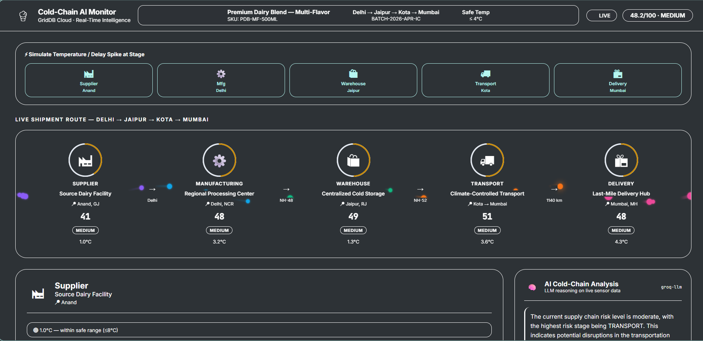
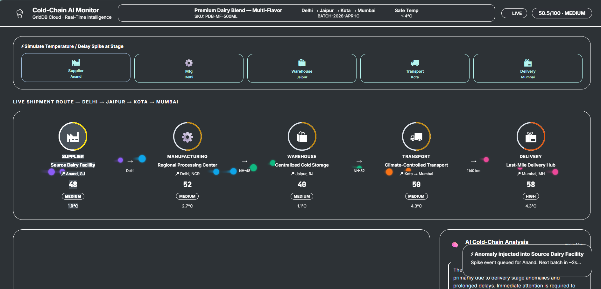
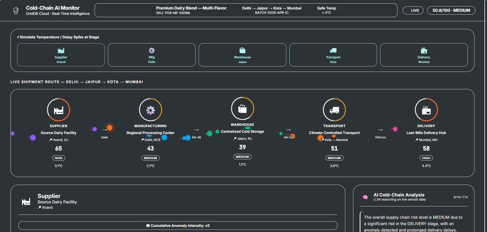
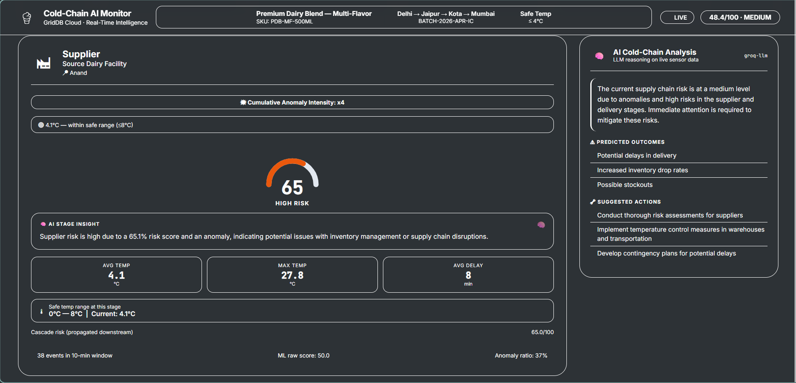
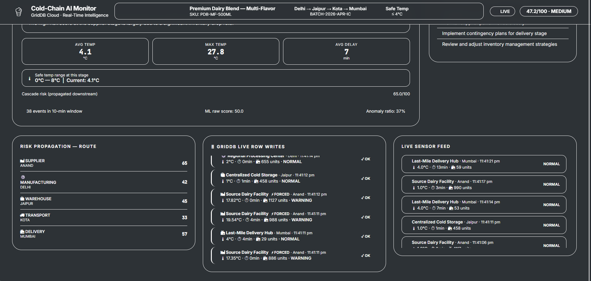

# AI-Powered Multi-Stage Supply Chain Intelligence System with GridDB

## Introduction

Most supply chain monitoring systems treat each stage in isolation and react only after a failure becomes visible. This system takes a different approach: it treats the supply chain as a connected pipeline, detects anomalies using machine learning, models how risk propagates across stages, and uses an LLM to turn numerical scores into actionable decisions.

The stack is: **GridDB Cloud** (time-series storage) → **Isolation Forest** (anomaly detection) → **Groq / Llama-3.1-8b-instant** (LLM reasoning) → **FastAPI + HTML dashboard** (real-time UI).


On startup the FastAPI app kicks off two background loops:

```python
# api/app.py — application startup (lifespan)
@asynccontextmanager
async def lifespan(app: FastAPI):
    db_client.initialize()                   # connect + ensure container exists
    train_if_needed()                        # bootstrap ML model if model.pkl missing
    asyncio.create_task(run_producer())      # async loop: simulate & write events to GridDB
    asyncio.create_task(_pipeline_worker())  # async loop: ML scoring + risk cascade + LLM insights
    logger.info("Supply Chain AI system started.")
    yield
```

---

## GridDB Cloud: Connection and Storage

After you create your [GridDB Cloud account](https://www.global.toshiba/ww/products-solutions/ai-iot/griddb/product/griddb-cloud.html), set up your credentials in `.env`. You can also provision an instance via the [Microsoft Azure Marketplace](https://portal.azure.com/#create/2812187.griddb_cloud_payasyougo) using Pay-As-You-Go.

All communication with GridDB Cloud goes through its **HTTPS Web API** — there is no Python driver. Credentials are passed as HTTP Basic Auth:

```python
# db/griddb_client.py — connection config
GRIDDB_HOST     = os.getenv("GRIDDB_HOST", "")
GRIDDB_PORT     = int(os.getenv("GRIDDB_PORT", "443"))
GRIDDB_CLUSTER  = os.getenv("GRIDDB_CLUSTER", "")
GRIDDB_DATABASE = os.getenv("GRIDDB_DATABASE", "public")
GRIDDB_USER     = os.getenv("GRIDDB_USER", "")
GRIDDB_PASSWORD = os.getenv("GRIDDB_PASSWORD", "")

# Port is part of the URL — GridDB Cloud runs on 443 (HTTPS)
_BASE_URL = f"https://{GRIDDB_HOST}:{GRIDDB_PORT}/griddb/v2/{GRIDDB_CLUSTER}/dbs/{GRIDDB_DATABASE}"

def _auth() -> httpx.BasicAuth:
    return httpx.BasicAuth(GRIDDB_USER, GRIDDB_PASSWORD)
```

On startup, `initialize()` validates all required env vars then calls `_ensure_container()` to create the TimeSeries container if it doesn't exist:

```python
# db/griddb_client.py
def initialize() -> None:
    missing = [var for var, val in {
        "GRIDDB_HOST": GRIDDB_HOST, "GRIDDB_CLUSTER": GRIDDB_CLUSTER,
        "GRIDDB_DATABASE": GRIDDB_DATABASE, "GRIDDB_USER": GRIDDB_USER,
        "GRIDDB_PASSWORD": GRIDDB_PASSWORD,
    }.items() if not val]
    if missing:
        raise RuntimeError(f"Missing config: {', '.join(missing)}")
    logger.info("GridDB client initialized.")
    _ensure_container()

def _ensure_container() -> None:
    url = f"{_BASE_URL}/containers"
    try:
        resp = httpx.post(url, json=CONTAINER_SCHEMA, auth=_auth(), timeout=15)
        if resp.status_code in (200, 201):
            logger.info("GridDB container '%s' created.", CONTAINER_NAME)
        elif resp.status_code != 409:   # 409 = already exists, that's fine
            logger.warning("Container status %s: %s", resp.status_code, resp.text)
    except Exception as exc:
        logger.error("Failed to ensure GridDB container: %s", exc)
```

### Why GridDB for Time-Series

GridDB is purpose-built for time-series workloads: high-frequency ingestion at low latency, fast time-window queries without complex indexing, and a memory-first architecture that keeps recent events immediately accessible for the ML pipeline.

### Time-Window Queries via the `/tql` Endpoint

Queries are sent as **HTTP POST** to the `/tql` endpoint. The TQL `TIMESTAMP(str)` function takes an ISO-8601 string, so the window boundary is computed in Python first:

```python
# db/griddb_client.py
def query_recent(stage: str | None = None, minutes: int = 10) -> list[dict]:
    ts_str = _ts_to_str(datetime.now(timezone.utc) - timedelta(minutes=minutes))
    tql = f"SELECT * WHERE timestamp > TIMESTAMP('{ts_str}')"
    if stage:
        tql += f" AND stage = '{stage}'"

    # POST the TQL statement to GridDB Cloud's /tql endpoint
    url  = f"{_BASE_URL}/tql"
    body = [{"name": CONTAINER_NAME, "stmt": tql + " LIMIT 5000"}]
    try:
        resp = httpx.post(url, json=body, auth=_auth(), timeout=15)
        if resp.status_code == 200:
            data    = resp.json()
            columns = [c["name"] for c in CONTAINER_SCHEMA["columns"]]
            rows    = data[0].get("results", []) if data else []
            return [dict(zip(columns, row)) for row in rows]
    except Exception as exc:
        logger.error("Query failed: %s", exc)
    return []
```

---

## Supply Chain Pipeline Model

The supply chain is modelled as five ordered stages, each feeding the next:

**Supplier → Manufacturing → Warehouse → Transport → Delivery**

Each stage has its own normal operating range and alert threshold:

```python
_STAGE_CFG: dict[str, dict] = {
    "SUPPLIER":      {"temp": (1,  5),  "thresh": 8,   "delay": (0,  5),  "inv": (800, 1200)},
    "MANUFACTURING": {"temp": (2,  7),  "thresh": 10,  "delay": (0,  8),  "inv": (500,  900)},
    "WAREHOUSE":     {"temp": (1,  4),  "thresh": 7,   "delay": (0,  6),  "inv": (300,  700)},
    "TRANSPORT":     {"temp": (3,  8),  "thresh": 12,  "delay": (0, 15),  "inv": (50,   200)},
    "DELIVERY":      {"temp": (4, 10),  "thresh": 15,  "delay": (0, 20),  "inv": (10,    80)},
}
```

---

## Event Simulation and Ingestion

The producer simulates realistic supply chain events — normal readings, drifting values, and injected anomalies — and writes them to GridDB every 2 seconds.

### Event Generation

```python
# ingestion/simulator.py
def _generate_event(
    stage: str,
    force_anomaly: bool = False,
    anomaly_rate: float = 0.02,
    drift_factor: float = 0.0,
) -> dict[str, Any]:
    cfg = _STAGE_CFG[stage]
    t_lo, t_hi = cfg["temp"]
    d_lo, d_hi = cfg["delay"]
    i_lo, i_hi = cfg["inv"]
    thresh      = cfg["thresh"]

    intensity  = _anomaly_intensity[stage] if force_anomaly else 0
    is_anomaly = force_anomaly or (random.random() < anomaly_rate)

    if is_anomaly:
        anomaly_type  = random.choice(["temp", "delay", "inventory", "combined"])
        base_spike    = _TEMP_SPIKE_ADD[stage]
        extra_degrees = intensity * 2.5

        if anomaly_type in ("temp", "combined"):
            temp = round(thresh + random.uniform(2, base_spike + extra_degrees), 2)
        else:
            temp = round(random.uniform(t_lo, t_hi), 2)

        multiplier = _DELAY_SPIKE_MUL + (intensity * 2)
        if anomaly_type in ("delay", "combined"):
            delay = int(random.uniform(d_lo, d_hi) * multiplier + random.uniform(5, 20))
        else:
            delay = int(random.uniform(d_lo, d_hi))

        if anomaly_type == "inventory":
            drop_frac = max(0.05, _INV_DROP_FRAC - intensity * 0.03)
            inventory = int(i_lo * drop_frac)
        else:
            inventory = int(random.uniform(i_lo, i_hi))

        status = STATUS_ANOMALY if anomaly_type == "combined" else STATUS_WARNING
    else:
        temp_ceiling = t_lo + (thresh - t_lo) * drift_factor
        temp      = round(random.uniform(t_lo, min(t_hi + drift_factor * 3, temp_ceiling or t_hi)), 2)
        delay     = int(random.uniform(d_lo, d_hi + drift_factor * 5))
        inventory = int(random.uniform(i_lo, i_hi))
        status    = STATUS_NORMAL if drift_factor < 0.5 else STATUS_WARNING

    return {
        "timestamp":   datetime.now(timezone.utc),
        "entity_id":   f"{stage[:3]}-{uuid.uuid4().hex[:6].upper()}",
        "stage":       stage,
        "temperature": temp,
        "delay":       delay,
        "inventory":   inventory,
        "status":      status,
    }
```

### High-Frequency Producer

```python
# ingestion/producer.py
async def run_producer() -> None:
    global _force_anomaly_stage, _injection_pending
    logger.info("Producer started - interval: %.1fs", INTERVAL)

    while True:
        try:
            forced = _force_anomaly_stage
            _force_anomaly_stage = None

            batch = generate_batch(
                anomaly_rate=float(os.getenv("ANOMALY_INJECTION_RATE", "0.02")),
                force_anomaly_stage=forced,
            )

            if forced:
                from ingestion.simulator import _generate_event
                extra_spikes = [_generate_event(forced, force_anomaly=True) for _ in range(2)]
                batch.extend(extra_spikes)

            await asyncio.gather(*[_insert_and_log(event, forced_stage=forced) for event in batch])

            if forced:
                _injection_pending = None
            else:
                decay_anomaly_intensity(decay_by=1)

        except Exception as exc:
            logger.error("Producer error: %s", exc)
            _injection_pending = None

        await asyncio.sleep(INTERVAL)  # default: 2 seconds
```

---

## Machine Learning: Anomaly Detection

The system uses an **Isolation Forest** (unsupervised) to score deviations from normal behavior. It operates on 7-element feature vectors extracted from time-series windows:

```python
# features/feature_engine.py
def feature_names() -> list[str]:
    return [
        "mean_temp", "max_temp", "std_temp",
        "mean_delay", "max_delay",
        "inventory_drop_rate",
        "anomaly_flag_ratio",
    ]
```

The pipeline: extract features → Isolation Forest scores deviation → risk engine blends ML score with rule-based penalties:

```python
# risk/risk_engine.py
# features is a numpy array with 7 elements — NOT a dict
# Index positions: [mean_temp, max_temp, std_temp, mean_delay, max_delay,
#                   inventory_drop_rate, anomaly_flag_ratio]

prediction   = model.predict(features)
ml_score     = prediction["score"]
rule_penalty = 0.0

# features[6] = anomaly_flag_ratio (ratio of non-NORMAL events in the window)
if features[6] > 0.3:
    rule_penalty += 15.0

risk_score = min(100.0, round(ml_score + rule_penalty, 1))
```

---

## Cascade Risk Propagation

A disruption at one stage leaks risk forward to every downstream stage. The cascade engine models this as a forward pass over the ordered pipeline:

```python
# risk/cascade.py
_PROPAGATION_ALPHA = 0.15

def propagate_risk(stage_risks: dict) -> dict:
    # Extract the raw risk score for each stage
    raw: dict[str, float] = {
        s: stage_risks[s].get("risk_score", 0.0)
        for s in STAGES if s in stage_risks
    }

    # Forward propagation: each stage inherits previous stage's risk leakage
    propagated: dict[str, float] = {}
    prev_risk = 0.0
    for stage in STAGES:
        base   = raw.get(stage, 0.0)
        leaked = _PROPAGATION_ALPHA * prev_risk
        combined = min(100.0, base + leaked * (1 - base / 100.0))
        propagated[stage] = round(combined, 1)
        prev_risk = combined

    global_risk = round(sum(propagated[s] * _CASCADE_WEIGHTS[s] for s in STAGES), 1)
    ...
```

A moderate TRANSPORT anomaly can push DELIVERY into high-risk territory before the truck arrives — which is exactly the kind of early warning this system is designed to surface.

---

## LLM-Powered Reasoning

Raw risk scores are fed to **Llama-3.1-8b-instant** (via Groq) which returns a structured JSON explanation: what is happening, why, predicted outcomes, and suggested actions.

```python
# llm/reasoning.py
def _build_prompt(stage_risks: dict, cascade: dict) -> str:
    lines = [
        "You are an expert supply chain intelligence system.",
        "Analyse the following real-time risk data and respond in JSON.\n",
        f"Global Risk Score: {cascade['global_risk']}/100 ({cascade['risk_level']})",
        f"Highest Risk Stage: {cascade['highest_risk_stage']}\n",
        "Stage-by-Stage Risk Breakdown:"
    ]
    for stage, risk_dict in stage_risks.items():
        f = risk_dict.get("features", {})
        lines.append(
            f"  {stage}: risk={risk_dict['risk_score']:.1f}/100 | "
            f"anomaly={'YES' if risk_dict['is_anomaly'] else 'no'} | "
            f"mean_temp={f.get('mean_temp', 0):.1f}°C | "
            f"mean_delay={f.get('mean_delay', 0):.1f}h"
        )
    lines.append(
        "\nRespond ONLY with valid JSON:\n"
        "{\n"
        '  "risk_level": "<LOW|MEDIUM|HIGH|CRITICAL>",\n'
        '  "summary": "<1-2 sentence overall assessment>",\n'
        '  "predicted_outcomes": ["<outcome 1>", "<outcome 2>", "<outcome 3>"],\n'
        '  "suggested_actions": ["<action 1>", "<action 2>", "<action 3>"],\n'
        '  "stage_insights": {\n'
        '    "<STAGE>": "<1 sentence stage-specific insight>"\n'
        '  }\n'
        "}"
    )
    return "\n".join(lines)


def get_insights(stage_risks: dict, cascade: dict) -> dict:
    """Call Groq LLM; falls back to rule-based response if API key is missing or call fails."""
    client = _get_client()          # lazily initialised Groq() instance, or None
    if client is None:
        return _rule_based_response(cascade, stage_risks)

    prompt = _build_prompt(stage_risks, cascade)
    try:
        response = client.chat.completions.create(
            model="llama-3.1-8b-instant",
            messages=[{"role": "user", "content": prompt}],
            temperature=0.3,
            max_tokens=600,
        )
        return json.loads(response.choices[0].message.content.strip())
    except Exception:
        return _rule_based_response(cascade, stage_risks)
```

---

## Real-Time Dashboard

The frontend polls two FastAPI endpoints every 2 seconds and updates the UI without any page reloads:

```javascript
// api/static/index.html
const POLL_NORMAL = 2000;  // ms between normal polls
const POLL_FAST   = 500;   // ms during anomaly injection

function scheduleNextPoll(ms){
  clearTimeout(_pollTimer);
  _pollTimer = setTimeout(poll, ms);
}

async function poll(){
  try{
    const [snap, ins] = await Promise.all([
      fetch('/api/snapshot').then(r=>r.json()),
      fetch('/api/insights').then(r=>r.json()),
    ]);

    // Not ready yet — keep polling quickly until warm-up completes
    if(!snap.ready){ scheduleNextPoll(2000); return; }

    updateNodes(snap.stage_risks);
    updateCascade(snap.cascade);
    updateInsights(ins);
  } catch(e){ console.error('Poll error:', e) }
  scheduleNextPoll(POLL_NORMAL);
}
```

### System in Action

#### Normal Stable Operations
Low-risk baseline across all stages when sensors are within safe parameters.


#### Manual Anomaly Injection
Inject anomalies into specific stages to stress-test the system.


#### Real-Time Cascade Propagation
A Transport failure automatically elevates Delivery risk even before the truck arrives.


#### LLM Reasoning & Stage Deep-Dive
The LLM explains why risk is rising and recommends corrective actions.


#### Live GridDB Row Ingestion
High-frequency inserts with `FORCED` tags for auditing injected events.


---

## Scenario: Cold-Chain Cascade Failure

A batch of **Premium Dairy Blend (SKU: PDB-MF-500ML)** ships Supplier → Manufacturing → Warehouse → Transport → Delivery:

1. **Supplier / Manufacturing** — steady readings, `NORMAL` status, low baseline risk.
2. **Warehouse** — a cooling fan vibrates; temperature creeps from -18°C toward -1°C. Still below the melt point, but the Temporal Engine flags the *direction* of change: stage turns **WARNING**.
3. **Transport** — compressor failure spikes the truck interior to **14°C**, well above the 10°C threshold. ML flags **HIGH RISK**.
4. **Delivery** — the Cascade Engine propagates the thermal debt forward. Delivery is flagged **HIGH RISK (85/100)** before the truck arrives, giving the ops team time to prepare a quarantine decision.

```text
Transport → ANOMALY: Critical Temp Spike (14°C)
Delivery  → HIGH RISK: Cascaded Thermal Debt
Result    → Automated Batch Quarantine Suggestion
```

---

## Conclusion

Supply chains degrade gradually through interconnected failures, not sudden single events. By combining GridDB time-series storage, unsupervised ML, cascade risk modelling, and LLM reasoning, this system moves from reactive monitoring to proactive intelligence — catching problems before they reach the customer.

---

## Quick Start

1. **Clone & Install**
   ```bash
   git clone https://github.com/ritigya03/GridDB-Real-Time-Supply-Chain-System
   cd GridDB-Real-Time-Supply-Chain-System && pip install -r requirements.txt
   ```

2. **Configure Credentials**
   Copy `.env.example` to `.env` and fill in your **GridDB Cloud** and **Groq API** credentials.

3. **Launch**
   ```bash
   uvicorn main:app --reload
   ```
   Open `http://127.0.0.1:8000/static/index.html`.

👉 **[View Full Source on GitHub](https://github.com/ritigya03/GridDB-Real-Time-Supply-Chain-System)**
